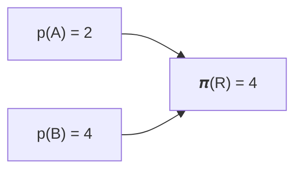

<div align="center"></div>
<div style="font-size: 6em; font-weight: bolder;" align="center">RTIC</div>

<h1 align="center">ハードウェアアクセラレーションを備えた Rust RTOS</h1>

<p align="center">リアルタイムシステムを構築するための並列フレームワーク</p>

# はじめに

この本には、Real-Time Interrupt-driven Concurrency
(RTIC) フレームワークのユーザー向けドキュメントが含まれています。API リファレンスは[こちら](../../api/)で利用できます。

これは RTIC v2.x のドキュメントです。 

以前のリリース:
[RTIC v1.x](/1) | [RTIC v0.5.x（非サポート）][v0_5] | [RTFM v0.4.x（非サポート）][v0_4] 

[v0_5]: https://github.com/rtic-rs/rtic/tree/release/v0.5
[v0_4]: https://github.com/rtic-rs/rtic/tree/release/v0.4

{{#include ../../../README.md:7:12}}

## RTIC は RTOS ですか？

RTIC が RTOS かどうかはよくある質問であり、あなたのバックグラウンドによって答えは異なる場合があります。RTIC の開発者の観点では、RTIC は、より古典的なソフトウェアカーネルではなく、Cortex-M MCU 上の NVIC や RISC-V 上の CLIC などのハードウェアを利用してスケジューリングを実行する、ハードウェアアクセラレーションされた RTOS です。

コミュニティにおけるもう 1 つの一般的な見方では、RTIC にはソフトウェアカーネルが存在せず、外部 HAL に依存していることから、RTIC は並列フレームワークであるとされています。

## RTIC - 過去、現在、そして未来

このセクションでは、RTIC モデルの背景を説明します。要点だけ知りたい場合は、セクション [RTIC モデル](preface.md#rtic-the-model) に進んでください。

RTIC フレームワークは、スウェーデンの Luleå University of Technology (LTU) におけるリアルタイムシステム研究を出発点としています。RTIC は、[Timber] 言語の並行モデル、[RTFM-SRP] ベースのスケジューラ、[RTFM-core] 言語、および [Abstract Timer] 実装から着想を得ています。関連研究の完全な一覧については、[RTFM][rtfm_publications] および [RTIC][rtic_publications] の出版物を参照してください。

[Timber]: https://web.archive.org/web/20230325133224/http://timber-lang.org/
[RTFM-SRP]: https://www.diva-portal.org/smash/get/diva2:1005680/FULLTEXT01.pdf
[RTFM-core]: https://ltu.diva-portal.org/smash/get/diva2:1013248/FULLTEXT01.pdf
[Abstract Timer]: https://ltu.diva-portal.org/smash/get/diva2:1013030/FULLTEXT01.pdf
[rtfm_publications]: http://ltu.diva-portal.org/smash/resultList.jsf?query=RTFM&language=en&searchType=SIMPLE&noOfRows=50&sortOrder=author_sort_asc&sortOrder2=title_sort_asc&onlyFullText=false&sf=all&aq=%5B%5B%5D%5D&aqe=%5B%5D&aq2=%5B%5B%5D%5D&af=%5B%5D
[rtic_publications]: http://ltu.diva-portal.org/smash/resultList.jsf?query=RTIC&language=en&searchType=SIMPLE&noOfRows=50&sortOrder=author_sort_asc&sortOrder2=title_sort_asc&onlyFullText=false&sf=all&aq=%5B%5B%5D%5D&aqe=%5B%5D&aq2=%5B%5B%5D%5D&af=%5B%5D

## Stack Resource Policy ベースのスケジューリング

[Stack Resource Policy (SRP)][SRP] ベースの並列とリソース管理は、RTIC フレームワークの中核にあります。SRP モデル自体は [Priority Inheritance Protocols] を拡張したものであり、シングルコアスケジューリングに対して優れた特性をいくつも提供します。たとえば次のとおりです。

- プリエンプティブで、デッドロックや競合状態のないスケジューリング
- リソース効率
  - タスクは単一の共有スタック上で実行される
  - タスクは共有リソースに wait-free にアクセスしつつ、run-to-completion で実行される
- 単一の（名前付き）クリティカルセクションによって優先度逆転が有界となる、予測可能なスケジューリング
- 静的解析に適した理論的基盤（例: タスクの応答時間やシステム全体のスケジューラビリティ）

SRP には、システム全体に関わる一連の要件があります:
- 各タスクには静的優先度が関連付けられていること、
- タスクはシングルコア上で実行されること、  
- タスクは run-to-completion でなければならないこと、および
- リソースは LIFO 順で取得/ロックされなければならないこと。

[SRP]: https://link.springer.com/article/10.1007/BF00365393
[Priority Inheritance Protocols]: https://ieeexplore.ieee.org/document/57058

## SRP の解析

SRP ベースのスケジューリングでは、各リソースの静的な *天井値* (𝝅) を計算するために、静的優先度タスクの集合と、それらの共有リソースへのアクセスが既知である必要があります。静的リソース *天井値* 𝝅(r) は、リソース `r` にアクセスする任意のタスクの静的優先度の最大値を表します。 

### 例

共有リソース `R` にアクセスする 2 つのタスク `A`（優先度 `p(A) = 2`）と `B`（優先度 `p(B) = 4`）を仮定します。`R` の静的天井値は 4 です（`𝝅(R) = max(p(A) = 2, p(B) = 4) = 4` から計算されます）。  

この例をグラフで表すと次のようになります:



## RTIC: ハードウェアアクセラレーションされたリアルタイムスケジューラ

SRP 自体は、動的優先度スケジューリングと静的優先度スケジューリングの両方に適合します。RTIC の実装では、静的優先度スケジューリングを高速化するために、基盤となるハードウェアを活用します。

`ARM Cortex-M` アーキテクチャでは、各割り込みベクタエントリ `v[i]` には、関数ポインタ (`v[i].fn`)、静的優先度 (`v[i].priority`)、enabled ビット (`v[i].enabled`) および pending ビット (`v[i].pending`) が関連付けられています。 

割り込み `i` は、次の条件のもとでハードウェアによりスケジュール（実行）されます:
1. `pending` かつ `enabled` であり、その優先度が（オプションの `BASEPRI`）レジスタより高いこと、および
1. 1 を満たす割り込みの中で最も高い優先度を持つこと。

最初の条件 (1) はフィルタと見なすことができ、これにより RTIC は、どのタスクの開始を許可し（また、どのタスクの開始を阻止するか）を制御できます。

一方、シングルコア静的スケジューリングに対する SRP モデルでは、タスクは次の条件のもとでスケジュール（実行）されるべきであるとされています:
1. 実行が `requested` されており、その静的優先度が現在のシステム天井値 (𝜫) より高いこと
1. 1 を満たすタスクの中で最も高い静的優先度を持つこと。

その類似性は際立っており、これは偶然でも幸運でも単なる一致でもありません。ハードウェアは、リアルタイムスケジューリングを念頭に置いて巧妙に設計されているのです。 

SRP スケジューリングをハードウェアにマッピングするには、システム天井値 (𝜫) をもう少し詳しく見る必要があります。SRP では、𝜫 は現在保持されているリソースの優先度天井値の最大値として計算されるため、システム動作中に動的に変化します。

### 例

上記のタスクモデルを仮定します。アイドル状態のシステムから開始すると、𝜫 は 0 です（どのタスクもリソースを保持していません）。`A` が実行要求されたとすると、直ちにスケジュールされます。`A` がリソース `R` を取得（ロック）すると仮定します。その取得（`R` のロック）の間は、`B` へのいかなる要求も開始をブロックされます（𝜫 = `max(𝝅(R) = 4) = 4` であり、`p(B) = 4` なので、SRP のスケジューリング条件 1 は満たされません）。

## マッピング

静的優先度の SRP ベーススケジューリングを Cortex M ハードウェアへマッピングするのは簡単です:

- 各タスク `t` は、対応する関数 `v[i].fn = t` を持つ割り込みベクタインデックス `i` にマッピングされ、静的優先度 `v[i].priority = p(t)` が与えられます。 
- 現在のシステム天井値は `BASEPRI` レジスタにマッピングされるか、またはそれに応じて割り込みイネーブルビットをマスクすることで実装されます。

### 例

ここまでの例では、ARM Cortex M [Nested Vectored Interrupt Controller (NVIC)][NVIC] のスナップショットは、（タスク `A` が実行のために pending 状態にされた後）次のような構成になる可能性があります。

```
| インデックス | Fn  | 優先度 | 有効 | 保留中 |
| ----- | --- | -------- | ------- | ------- |
| 0     | A   | 2        | true    | true    |
| 1     | B   | 4        | true    | false   |

[NVIC]: https://developer.arm.com/documentation/ddi0337/h/nested-vectored-interrupt-controller/about-the-nvic

（後で説明するように、割り込みベクタと例外ベクタの割り当てはユーザーに委ねられます。）


claim（lock(r)）は現在のシステム天井値（𝜫）を変更し、*名前付き*クリティカルセクションとして実装できます。 
  - old_ceiling = 𝜫, 𝜫 = 𝝅(r)  
  - クリティカルセクション内のコードを実行
  - 𝜫 = old_ceiling

これはリソース保護メカニズムに相当し、`BASEPRI` レジスタを管理するために、クリティカルセクションへの入場時にはわずか 2 つ、退出時には 1 つの機械命令しか必要としません。`BASEPRI` を備えていないアーキテクチャでは、名前付きクリティカルセクションへの入出時に割り込みを無効化/有効化する一連の機械命令によってシステム天井値を実装できます。必要な機械命令数は、更新しなければならないマスクレジスタの数によって異なります（単一の機械操作で最大 32 個の割り込みを扱えるため、M0/M0+ アーキテクチャでは 1 命令で十分です）。RTIC はコンパイル時に天井値とマスキング定数を決定するため、すべての操作は Rust の用語で言えばゼロコストです。

このようにして RTIC は、SRP ベースのプリエンプティブスケジューリングと、ゼロコストでハードウェアにより高速化された実装を融合し、「クラス最高」の保証と性能を実現します。 

このアプローチはきわめて単純であるにもかかわらず、なぜ SRP とハードウェアにより高速化されたスケジューリングは、他のどの主流 RTOS にも採用されていないのでしょうか。

答えは簡単です。一般的に採用されているスレッドモデルは静的解析にあまり向いていません。つまり、コンパイル時にソースコードからタスク/リソースの依存関係を抽出する既知の方法が存在しません（そのため天井値を効率的に計算できず、リソースロックの LIFO 要件も保証できません）。したがって、SRP ベースのスケジューリングは、一般にはどのスレッドベース RTOS にとっても手の届かないものです。 

## RTIC の未来

さまざまな形態の非同期プログラミングが、ますます人気を集め、言語レベルのサポートも広がっています。Rust は協調的マルチタスクのための `async`/`await` API をネイティブに提供しており、コンパイラは実行コンテキストの保存と復元に必要な定型コードを生成します（つまり、各 `await` をまたいで存続するローカル変数群を管理します）。 

Rust 標準ライブラリは、動的に割り当てられるデータ構造のためのコレクションを提供しており、これは実行時に実行コンテキストを管理するのに有用です。しかし、リソース制約の厳しいリアルタイムシステムという文脈では、動的割り当ては問題があります（性能と信頼性の両面においてです。Rust はメモリ不足状態になると *panic* を起こします）。したがって、静的割り当てが望ましいアプローチです！

モデリングの観点では、`async/await` は SRP の run-to-completion 要件を取り払い、2 つの yield point（`await`）の間にある各コード区間を個別のタスクとみなせます。コンパイラは、リソースを保持したまま `await` しようとするあらゆる試みを拒否します（そうしないと、SRP におけるリソース使用の厳密な LIFO 要件が破られるためです）。

では、技術的な話をいったん脇に置くとして、`async/await` は何をもたらすのでしょうか？

答えは、使い勝手の向上です！繰り返し現れるユースケースの 1 つは、タスクが一連の要求を実行し、その結果を待って先へ進むというものです。`async`/`await` がなければ、プログラマはタスクを個別のサブタスクに分割し、何らかの状態表現を維持しなければならず（そしてサブタスクを選択しながら手動で進行させることになります）。`async/await` を使うと、各 yield point（`await`）は本質的に 1 つの状態を表し、進行の仕組みは `Futures` によってコンパイル時に自動的に構築されます。 

Rust の `async`/`await` サポートは、依然として不完全であったり、現在も開発中であったりします。それでも、一般的なユースケースの大半はカバーしており、本番利用可能と見なせます。 

重要な性質として、future は合成可能です。そのため、利用可能な future のいずれか、すべて、または任意の組み合わせを await できます（これにより、たとえばタイムアウトや非同期エラーを迅速に処理できます）。

## RTIC モデル

RTIC の `app` は、シングルコアアプリケーション向けの宣言的かつ実行可能なシステムモデルであり、（`init`、`idle`、*ハードウェア*、*ソフトウェア* の）タスク群によって操作される（`local` および `shared` の）リソース群を定義します。要するに、`init` タスクは他のどのタスクよりも先に実行され、リソース群（`local` と `shared`）を返します。タスクは関連付けられた静的優先度に基づいてプリエンプティブに実行され、`idle` は最も低い優先度を持ちます（そしてバックグラウンド処理や、何らかのイベントで起床するまでシステムをスリープさせるために使用できます）。ハードウェアタスクは基盤となるハードウェア割り込みに束縛される一方、ソフトウェアタスクは非同期エグゼキュータによってスケジュールされます（ソフトウェアタスクの優先度ごとに 1 つ）。 

コンパイル時に、タスク/リソースモデルは SRP のもとで解析され、次の優れた特性を持つ実行可能コードが生成されます：

- 単一の共有スタック上で、競合のないリソースアクセスとデッドロックのない実行が保証される（SRP のおかげ）
  - ハードウェアタスクのスケジューリングはハードウェアによって直接行われ、
  - ソフトウェアタスクのスケジューリングは、そのアプリケーション向けに自動生成された async エグゼキュータによって行われます。

RTIC API の設計は、SRP の要件と Rust の健全性規則の両方が常に満たされることを保証するため、この実行可能モデルは構成により正しいものになります。全体として、生成されたコードは手書き実装と比べて追加のオーバーヘッドを生じさせないため、Rust の用語で言えば RTIC は並列に対するゼロコスト抽象化を提供します。